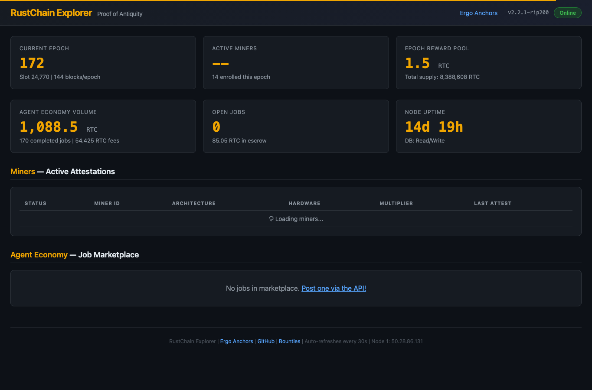
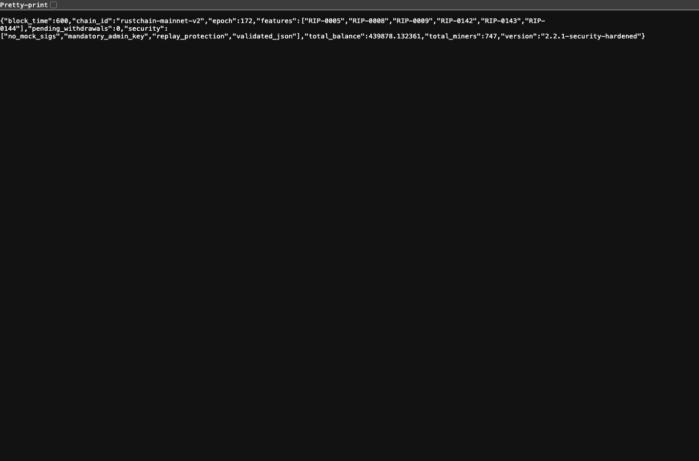
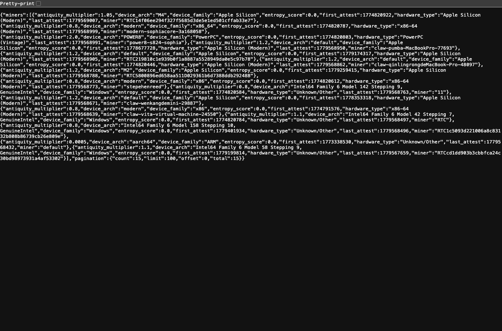

# RustChain Block Explorer Bug Hunt #517

Tested on 2026-05-23 from macOS with Google Chrome headless `--ignore-certificate-errors` and curl.

## Pages visited

1. `https://50.28.86.131/explorer/`
2. `https://50.28.86.131/anchors`
3. `https://50.28.86.131/api/stats`
4. `https://50.28.86.131/api/miners`

## Screenshots








## Bugs found

### Bug 1: Miners dashboard stays stuck even though the miners API works

Steps to reproduce:

1. Open `https://50.28.86.131/explorer/`.
2. Wait for the dashboard refresh to finish.
3. Compare the visible dashboard with `https://50.28.86.131/api/miners`.

Actual:

- The dashboard shows `Active Miners` as `--`.
- The miners table remains on `Loading miners...`.
- `/api/miners` returns HTTP 200 with live miner records.

Expected:

- The dashboard should render the miner count and miner rows from the live API response.

Probable cause:

The frontend checks `miners && miners.length` and then calls `miners.sort(...)`, but the live API response is an object with a `miners` property rather than a raw array:

```json
{
  "miners": [
    {
      "miner": "RTC14f06ee294f327f5685d3de5e1ed501cffab33e7",
      "device_family": "Apple Silicon",
      "last_attest": 1779568994
    }
  ]
}
```

The frontend likely needs to normalize with something like `const minerRows = Array.isArray(miners) ? miners : miners?.miners`.

### Bug 2: Explorer links to a missing Anchors route

Steps to reproduce:

1. Open `https://50.28.86.131/explorer/`.
2. Click the `Ergo Anchors` link in the header or footer.
3. Observe `https://50.28.86.131/anchors`.

Actual:

- `/anchors` returns HTTP 404.
- The explorer exposes the broken link in two places.

Expected:

- The link should point to a deployed Anchors page, redirect to the correct path, or be hidden until available.

## Endpoint checks

```text
/explorer/        200 text/html
/anchors          404 text/html
/api/miners       200 application/json
/api/stats        200 application/json
/api/blocks       404 text/html
/explorer/blocks  404 text/html
```

## Payout

RTC wallet: `RTC21cb705df64c81dcea3286a153453351b64aadae`
